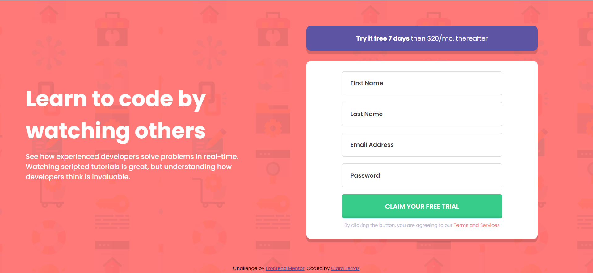

# Frontend Mentor - Intro component with sign up form solution

This is a solution to the [Intro component with sign up form challenge on Frontend Mentor](https://www.frontendmentor.io/challenges/intro-component-with-signup-form-5cf91bd49edda32581d28fd1). Frontend Mentor challenges help you improve your coding skills by building realistic projects.

## Table of contents

- [Overview](#overview)
  - [The challenge](#the-challenge)
  - [Screenshot](#screenshot)
  - [Links](#links)
- [My process](#my-process)
  - [Built with](#built-with)
  - [What I learned](#what-i-learned)
  - [Continued development](#continued-development)
  - [Useful resources](#useful-resources)
- [Author](#author)

## Overview

### The challenge

Users should be able to:

- View the optimal layout for the site depending on their device's screen size
- See hover states for all interactive elements on the page
- Receive an error message when the `form` is submitted if:
  - Any `input` field is empty. The message for this error should say _"[Field Name] cannot be empty"_
  - The email address is not formatted correctly (i.e. a correct email address should have this structure: `name@host.tld`). The message for this error should say _"Looks like this is not an email"_

### Screenshot




### Links

- Solution URL: [](https://github.com/claraferraz/intro-component-with-signup-form)
- Live Site URL: [](https://claraferraz.github.io/intro-component-with-signup-form/)

## My process

### Built with

- Semantic HTML5 markup
- CSS custom properties
- Flexbox
- CSS Grid
- Mobile-first workflow
- JavaScript form validation

### What I learned

I practiced a little bit more about forms with HTML and learned from scratch how to make a form validation on JS. I learned how to add a class on an HTML element through JS. And it was also the fist time I did a mobile-first workflow.

Here are some examples on what I've learned:

```css
.input-control img {
  visibility: hidden;
  position: absolute;
  top: 16px;
  right: 16px;
  z-index: 2;
}
.input-control.error img {
  visibility: visible;
}
```

```js
const setError = (input, message) => {
  const inputControl = input.parentElement;
  const errorDisplay = inputControl.querySelector(".error");

  errorDisplay.innerText = message;
  inputControl.classList.add("error");
};
```

### Continued development

This is my first Frontend project with JS and it gave me inspiration to continue working and learning JS so I can make my websites as functional as I would like them to be.

### Useful resources

- [](https://dev.to/javascriptacademy/form-validation-using-javascript-34je) - I learned form validation on JS on this link
- [](https://www.youtube.com/watch?v=rsd4FNGTRBw) - this video helped me with the icon on the input when the form had an error.

## Author

- Website - [Clara Ferraz](https://github.com/claraferraz)
- Frontend Mentor - [@yourusername](https://www.frontendmentor.io/profile/claraferraz)
